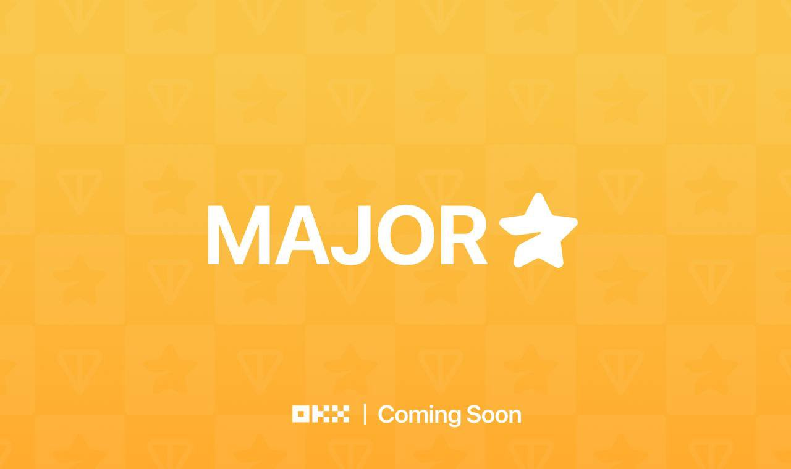

# MAJOR CLAIMER BOT

Major is telegram web app mining on telegram



## Prerequisite

- Node JS (v14)
- Git
- Major https://t.me/major/start?startapp=749493015
  
## BOT Feature

- 🤖 Auto Check In
- 🪙 Auto Play bonus coin
- ⭐ Auto Play swap coin
- 🎯 Auto Play rolloute
- 🧩 Auto Play puzzle
- 🎖️ Auto Complete missions

## Register Major Account

- Register major on telegram https://t.me/major/start?startapp=749493015
- Start bot `/start`
- Launch Major

## Set Up And Run

- clone the project `git clone https://github.com/rogersovich/major-claimer-bot.git`
- run `cd major-claimer-bot`.
- run `npm install && mkdir -p accounts`.
- run `cp src/config/config_tmp.js src/config/config.js && cp src/config/proxy_list_tmp.js src/config/proxy_list.js`
- To configure the app, run `nano src/config/config.js` and add your telegram app id and hash there (if you use telegram sessions)
- To Configure Proxy, run `nano src/config/proxy_list.js` and fill up your proxy using provided format (it currently support only HTTPS proxy), if you don't use proxy then just let it blank [].
   ```
   export const proxyList = [];
   ```
- run `npm run start`

## Setup Accounts

1. Run bot `npm run start`
2. Choose option `1` to create account
3. Choose account type `Query`
4. `Query` Type
   1. Enter Account Name
   2. Enter Telegram Query (you can get query by opening bot app on browser > inspect element > storage / application > session storage > telegram init params > copy tg web app data value)
   3. Start The bot Again after account creation complete
5.  after bot started choose option `2` start bot
6.  if something wrong with your Account, just delete problematic a, to cancel running bot press `ctrl + c` twice, and start again [from No 1.](#setup-accounts)

## Query Troubleshoot
if your bot get eror, with some error code `401` it mean your query expired, go get new query and run bot again and choose option `3` for query modification. 

## How To Update

- run `git pull` or `git stash && git pull`
- run `npm update`
- read Setup and run again if any new step added
- run the bot again `npm run start`


## Notes

- For **play puzzle durov** you need fill up the code in `src/config/settings.js` -> `puzzle_code` day by day, , you can find the code in [Twitter](https://x.com/).
- For **complete task youtube** -> `youtube_code` you need fill up the code in `src/config/settings.js`, you can find the code in [Twitter](https://x.com/).

## Support

To support me please give me ⭐ in this github repository. Thank you semoga pada JP 🔥

## 📜 License

This project is licensed under the MIT License - see the [LICENSE](LICENSE) file for details.